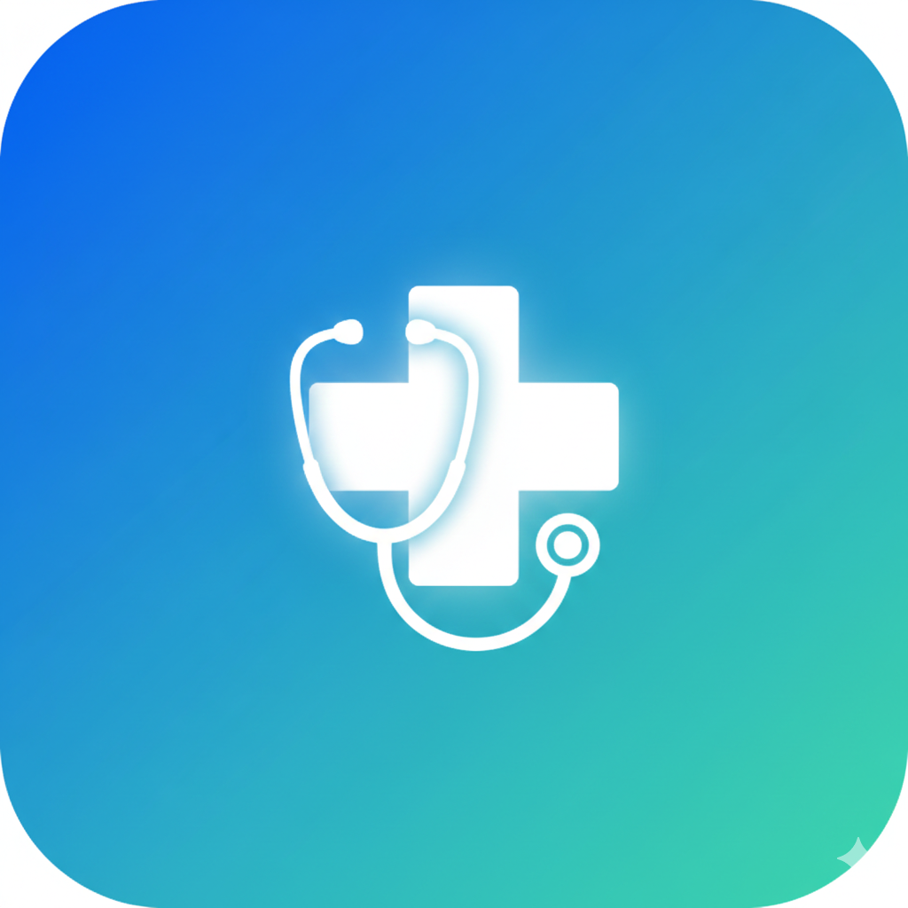

<div align="center">
  
  <h1>Multilingual AI Healthcare FYP</h1>
  <p><strong>An AI-powered bilingual (English & Urdu) healthcare assistant.</strong></p>
</div>

---

## 🌟 Overview
The **Multilingual AI Healthcare** platform is a comprehensive diagnostic assistant designed to bridge language barriers in healthcare. Built as a Final Year Project (FYP), it features an intelligent symptom checker, automated lab report analysis, and AI-driven X-ray diagnostics. 

By supporting both **English and Urdu**, it ensures accessibility for a broader demographic, allowing users to communicate symptoms naturally via voice or text.

## 🚀 Features
- **🗣️ Multilingual Voice AI:** Speak your symptoms in Urdu or English, and the AI will transcribe, understand, and map them to precise medical conditions.
- **🩺 Smart Symptom Checker:** Get AI-driven preliminary diagnoses based on your exact symptoms.
- **📄 Lab Report Analysis:** Upload your medical reports, and the AI will summarize the findings in simple terms.
- **🩻 X-Ray Diagnostics:** Advanced Deep Learning backend for analyzing X-rays (e.g., Pneumonia detection).
- **🌍 Bilingual Interface:** Toggle the entire app UI between English and Urdu instantly.

## 📸 Screenshots
*(You can add more app screenshots here later! Place your screenshot images in the `firstapp/assets/images/` folder and link them below)*

<div align="center">
  
</div>

## 🛠️ Technology Stack
### Frontend (Mobile App)
- **Framework:** [Flutter](https://flutter.dev/)
- **State Management:** Provider
- **Voice/Speech:** Flutter TTS, Groq Whisper API (for high-speed Urdu/English transcription)
- **LLM Integration:** Groq LLaMA 3 for extracting medical data from speech.

### Backend (API & AI Models)
- **Framework:** [FastAPI](https://fastapi.tiangolo.com/) (Python)
- **Deep Learning:** TensorFlow/Keras (for X-ray analysis like `pneumonia_model.h5`)
- **Data Processing:** Pandas, NumPy

## 📂 Project Structure
This is a monorepo containing both the mobile application and the backend server.

```text
Multilingual-Symptom/
│
├── firstapp/             # Flutter Mobile Application
│   ├── lib/              # Frontend Dart code (Screens, Services, Providers)
│   └── assets/           # Images, Audio, and local data
│
└── Backend/              # FastAPI Backend Server
    └── MedicalModelAPI/  # AI models, routes, and logic
```

## ⚙️ How to Run Locally

### 1. Backend (FastAPI)
```bash
cd Backend/MedicalModelAPI
python -m venv venv
# Activate venv (Windows: venv\Scripts\activate, Mac/Linux: source venv/bin/activate)
pip install -r requirements.txt
uvicorn app:app --reload
```

### 2. Frontend (Flutter)
**Important:** You must add your Groq API Key to `firstapp/lib/services/voice_service.dart` before running the app.
```bash
cd firstapp
flutter pub get
flutter run
```

## 👨‍💻 Developed By
**Manan Ali** - Final Year Project 
